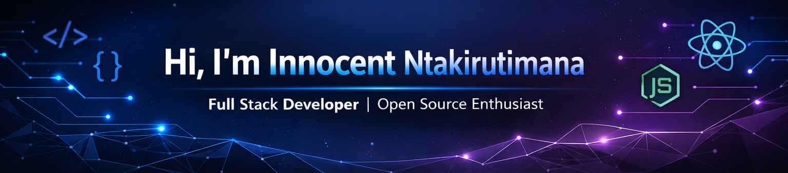

  <!-- Hero Banner -->
  

  <!-- Typing effect -->
  

---

### 🚀 About Me
- 🔭 Currently building **scalable web applications** and backend systems.  
- 🌱 Learning **Advanced Architecture & AI Integration**.  
- 👯 Looking to collaborate on **Open Source Projects**.  
- 💬 Ask me about **Full Stack Development, NestJS, React, Laravel, and Microservices**.  
- 📫 Contact: [innocentntakir@gmail.com](mailto:innocentntakir@gmail.com)  

---

### 🛠️ Tech Stack

  
  
  
  
  
  
  
  
  

---

### 💻 Projects Showcase

**1. Me-For-You – Event Planning System**  
[GitHub Repo](#) | Web app for managing events, vendors, and clients.  

**2. EVuba Connect – Automated CRM**  
[GitHub Repo](#) | Manages customers, leads, automated workflows, and reports.  

**3. Easy Buy – E-Commerce Platform**  
[GitHub Repo](#) | Full-featured online shopping platform with payment integration.  

**4. IVARA – Microservices Platform**  
[GitHub Repo](#) | 9 independent service categories, each running as a microservice.  

**5. School Management System – NestJS Backend**  
[GitHub Repo](#) | Backend APIs for managing students, teachers, classes, attendance, and results.

---

### 📊 GitHub Stats

<!-- Main GitHub Stats Card -->

  

<!-- Top Languages Card -->

  

<!-- GitHub Streak Card -->

  

---

### 🤝 Connect with Me

  
  
  

